<div align="center">


# Gandhigram Rural Institute — Mobile & Web Application

**A production-grade, AI-powered Flutter application for Gandhigram Rural Institute – Deemed to be University**

[](https://flutter.dev)
[](https://dart.dev)
[](https://www.postgresql.org)
[](https://python.org)
[](https://nodejs.org)
[](LICENSE)
[](https://github.com/vijaymahes9080/GRI)

[🌐 Official Website](https://ruraluniv.ac.in) · [📄 SRS Document](docs/srs_specification.md) · [🗄️ Database Schema](docs/database/schema.sql) · [📦 Data Blueprint](research/data_collection/data_collection_blueprint.md)

</div>

---

## 📖 Overview

The **GRI Mobile & Web Application** is a unified, enterprise-grade digital platform designed for **Gandhigram Rural Institute – Deemed to be University** (Dindigul, Tamil Nadu). It brings together every facet of campus life — academics, administration, library, hostel, placements, village outreach, and an AI-powered knowledge assistant — into a single, beautifully designed cross-platform app.

Built with **Flutter** (Android · iOS · Web), backed by **Node.js / FastAPI microservices**, and enhanced by a **RAG-based AI Chatbot** trained on GRI's official documents and regulations.

---

## ✨ Key Features

| Category | Features |
|---|---|
| 🎓 **Academics** | Timetable, Attendance (Geo-fenced BLE), Course Material, Internal Marks |
| 📝 **Examinations** | Hall Tickets, Results, Grade Calculator, Ph.D. Tracking |
| 💳 **Finance** | Fee Payment (UPI/Razorpay), Receipts, Scholarship Applications |
| 📚 **Library** | OPAC Search, Book Issue/Return, Fine Payment, RFID Locator |
| 🏠 **Hostel** | Room Allotment, Digital Out-Pass (Parent + Warden Approval), Mess Feedback |
| 💼 **Placement** | Drive Notifications, Resume Builder, Interview Scheduler, Analytics |
| 🤖 **AI Assistant** | RAG Chatbot (Tamil & English), Trained on GRI Regulations & Syllabi |
| 🏘️ **Village Outreach** | Geo-tagged Survey Collection, UBA Project Tracker, Extension Activity Logs |
| 🔔 **Notifications** | FCM Push, SMS, Email Alerts (Exam, Fee, Attendance, Events) |
| 🪪 **Digital Identity** | Offline NFC/QR Smart ID Card, Bluetooth Gate Entry |
| 🚌 **Transport** | Route Maps, Pass Management, Real-time Bus Tracking |
| 📢 **Complaints** | Multi-category Grievance Portal with Priority Escalation |

---

## 🗺️ 15-Stage Development Pipeline

```mermaid
flowchart LR
    S1([✅ Stage 1\nRequirements]) --> S2([✅ Stage 2\nData Collection])
    S2 --> S3([✅ Stage 3\nDatabase Design])
    S3 --> S4([🔄 Stage 4\nUI/UX Design])
    S4 --> S5([⏳ Stage 5\nFlutter Dev])
    S5 --> S6([✅ Stage 6\nBackend APIs])
    S6 --> S7([✅ Stage 7\nAuthentication])
    S7 --> S8([✅ Stage 8\nAI Chatbot + RAG])
    S8 --> S9([✅ Stage 9\nERP Integration])
    S9 --> S10([✅ Stage 10\nNotifications])
    S10 --> S11([✅ Stage 11\nSecurity])
    S11 --> S12([⏳ Stage 12\nTesting])
    S12 --> S13([⏳ Stage 13\nCloud Deploy])
    S13 --> S14([⏳ Stage 14\nScalability])
    S14 --> S15([⏳ Stage 15\nMaintenance])
```



| Stage | Title | Status | Docs |
|:---:|---|:---:|---|
| 1 | Requirement Engineering | ✅ Complete | [SRS Specification](docs/srs_specification.md) |
| 2 | Website Data Collection | ✅ Complete | [Data Blueprint](research/data_collection/data_collection_blueprint.md) |
| 3 | Database Design | ✅ Complete | [Schema SQL](docs/database/schema.sql) |
| 4 | UI/UX Design | ✅ Complete | [UI/UX Specification](docs/ui_ux/ui_ux_specification.md) |
| 5 | Flutter Development | ✅ Complete | [Flutter Architecture](docs/flutter_architecture.md) |
| 6 | Backend APIs | ✅ Complete | [Backend Architecture](docs/backend_architecture.md) |
| 7 | Authentication | ✅ Complete | [Authentication Architecture](docs/authentication_architecture.md) |
| 8 | AI Chatbot + RAG | ✅ Complete | [AI RAG Architecture](docs/ai_rag_architecture.md) |
| 9 | ERP Integration | ✅ Complete | [ERP Integration Architecture](docs/erp_integration_architecture.md) |
| 10 | Notifications | ✅ Complete | [Notifications Architecture](docs/notifications_architecture.md) |
| 11 | Security & Compliance | ✅ Complete | [Security Architecture](docs/security_architecture.md) |
| 12 | Testing & QA | ⏳ Pending | — |
| 13 | Cloud Deployment | ⏳ Pending | — |
| 14 | Scalability | ⏳ Pending | — |
| 15 | Maintenance & Expansion | ⏳ Pending | — |

---

## 🏗️ Architecture Overview

```
┌─────────────────────────────────────────────────────┐
│              Flutter App (iOS · Android · Web)       │
│    Student · Faculty · Parent · Admin · Alumni       │
└────────────────────┬────────────────────────────────┘
                     │ HTTPS / WebSocket
┌────────────────────▼────────────────────────────────┐
│               Kong API Gateway                       │
│         (Rate Limiting · Auth · Logging)             │
└──┬───────┬─────────┬──────────┬──────────┬──────────┘
   │       │         │          │          │
┌──▼──┐ ┌──▼──┐ ┌───▼───┐ ┌───▼──┐ ┌──────▼──────┐
│Auth │ │Acad │ │Finance│ │Place │ │AI RAG       │
│Svc  │ │Svc  │ │Svc    │ │Svc   │ │Chatbot Svc  │
└──┬──┘ └──┬──┘ └───┬───┘ └───┬──┘ └──────┬──────┘
   │       │         │          │           │
┌──▼───────▼─────────▼──────────▼───────────▼───────┐
│   PostgreSQL 16  ·  Redis Cache  ·  ChromaDB        │
│   (Partitioned · RLS · pgvector · Read Replicas)    │
└────────────────────────────────────────────────────┘
```

---

## 🛠️ Tech Stack

### Frontend
| Technology | Purpose |
|---|---|
| Flutter 3.x (Dart) | Cross-platform UI — Android, iOS, Web |
| Riverpod / Bloc | State Management |
| GoRouter | Navigation & Deep Links |
| flutter_local_notifications | Local push notifications |
| firebase_messaging | FCM push notifications |
| hive / isar | Local offline-first storage |
| google_maps_flutter | Campus map & transport tracking |

### Backend
| Technology | Purpose |
|---|---|
| Node.js 20 + Express | Primary REST API gateway |
| Python 3.11 + FastAPI | AI/ML microservices |
| Apache Airflow 2.9 | ETL & data pipeline orchestration |
| Scrapy + Playwright | Web data collection |

### Database & Storage
| Technology | Purpose |
|---|---|
| PostgreSQL 16 + pgvector | Primary relational DB + AI embeddings |
| Redis 7 | Session cache, rate limiting, pub/sub |
| ChromaDB | Vector store for RAG knowledge base |
| MinIO | S3-compatible document & image storage |

### AI / ML
| Technology | Purpose |
|---|---|
| LangChain 0.2 | RAG pipeline orchestration |
| Sentence Transformers (MiniLM-L6-v2) | Document embedding |
| Gemini / GPT-4o API | LLM for chatbot responses |
| PyMuPDF | PDF text extraction |

### DevOps & Cloud
| Technology | Purpose |
|---|---|
| Docker + Kubernetes | Containerization & orchestration |
| GitHub Actions | CI/CD pipelines |
| AWS / GCP | Cloud infrastructure |
| Prometheus + Grafana | Monitoring & alerting |
| ELK Stack | Centralized logging |

---

## 📂 Repository Structure

```
GRI/
├── 📁 lib/                          # Flutter Dart source code
│   ├── core/                        # App constants, themes, utilities
│   ├── models/                      # Data models
│   ├── providers/                   # Riverpod / Bloc state providers
│   ├── repositories/                # Data access layer
│   ├── routes/                      # App routing (GoRouter)
│   ├── screens/                     # UI screens
│   └── widgets/                     # Reusable UI components
│
├── 📁 docs/                         # Project documentation
│   ├── srs_specification.md         # Software Requirement Specification
│   └── database/
│       └── schema.sql               # Full PostgreSQL schema
│
├── 📁 research/                     # Research & data artifacts
│   └── data_collection/
│       ├── scrapers/                # BS4, Scrapy, Playwright scrapers
│       ├── etl/                     # Apache Airflow DAG
│       ├── schemas/                 # JSON schemas
│       └── data_collection_blueprint.md
│
├── 📁 android/                      # Android platform files
├── 📁 ios/                          # iOS platform files
├── 📁 web/                          # Web platform files
├── 📁 assets/                       # App assets (images, JSON, fonts)
├── 📄 pubspec.yaml                  # Flutter dependencies
├── 📄 composer.json                 # Project metadata
├── 📄 README.md                     # This file
├── 📄 LICENSE                       # MIT License
└── 📄 .gitignore                    # Git ignore rules
```

---

## 🚀 Getting Started

### Prerequisites
- [Flutter SDK 3.x](https://flutter.dev/docs/get-started/install)
- [Dart SDK 3.x](https://dart.dev/get-dart)
- [Android Studio / VS Code](https://flutter.dev/docs/get-started/editor)
- [PostgreSQL 16](https://www.postgresql.org/download/)
- [Python 3.11+](https://www.python.org/downloads/)
- [Node.js 20+](https://nodejs.org/)

### Flutter Setup

```bash
# 1. Clone the repository
git clone https://github.com/vijaymahes9080/GRI.git
cd GRI

# 2. Install Flutter dependencies
flutter pub get

# 3. Generate platform files (if needed)
flutter create --platforms android,ios,web .

# 4. Run on device / emulator
flutter run

# 5. Run on Web
flutter run -d chrome
```

### Database Setup

```bash
# 1. Create PostgreSQL database
createdb gri_db

# 2. Run the schema
psql -U postgres -d gri_db -f docs/database/schema.sql

# 3. Verify extensions
psql -U postgres -d gri_db -c "\dx"
```

### Data Collection Setup

```bash
# 1. Install Python dependencies
cd research/data_collection
pip install -r requirements.txt

# 2. Install Playwright browsers
playwright install chromium

# 3. Run BeautifulSoup4 scraper
python scrapers/gri_bs4_parser.py

# 4. Run Playwright scraper
python scrapers/gri_playwright_spider.py

# 5. Run Scrapy spider
scrapy crawl gri_spider -O data/scrapy_output.json
```

---

## 🔒 Security

- All sensitive data encrypted with **AES-256** at rest; **TLS 1.3** in transit.
- Authentication via **OAuth 2.0 + JWT** with refresh token rotation.
- **Row-Level Security (RLS)** enforced at the PostgreSQL layer.
- **OWASP Top 10** mitigations applied across all API endpoints.
- Compliant with **Indian DPDP Act 2023**.

---

## 🤝 Contributing

This is an official academic project for Gandhigram Rural Institute. Contributions are welcomed from GRI community members.

1. Fork the repository.
2. Create a feature branch: `git checkout -b feature/your-feature-name`
3. Commit your changes: `git commit -m "feat: your descriptive message"`
4. Push: `git push origin feature/your-feature-name`
5. Open a Pull Request.

---

## 👨‍💻 Author

| Field | Detail |
|---|---|
| **Name** | Vijay Mahes |
| **Email** | [Vijaypradhap2004@gmail.com](mailto:Vijaypradhap2004@gmail.com) |
| **GitHub** | [@vijaymahes9080](https://github.com/vijaymahes9080) |
| **Repository** | [github.com/vijaymahes9080/GRI](https://github.com/vijaymahes9080/GRI) |

---

## 📜 License

This project is licensed under the **MIT License** — see the [LICENSE](LICENSE) file for full details.

---

<div align="center">

**Gandhigram Rural Institute – Deemed to be University**  
Gandhigram, Dindigul – 624 302, Tamil Nadu, India  
🌐 [ruraluniv.ac.in](https://ruraluniv.ac.in) · 📧 [info@ruraluniv.ac.in](mailto:info@ruraluniv.ac.in)

*"Combining Higher Education with Rural Reconstruction"*

</div>
