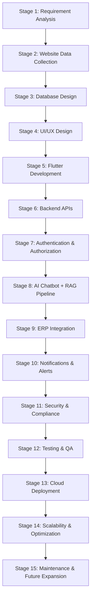

# GRI (Gandhigram Rural Institute) Portal & Mobile Application

A comprehensive, modern multi-platform application (Flutter Mobile/Web + Node.js/Python Backend + AI Chatbot RAG) for Gandhigram Rural Institute.

---

## 🗺️ Project Roadmap & Pipeline

---

## 📋 Implementation Stages Overview

### Stage 1: Requirement Analysis
- Stakeholder discovery & needs assessment for students, faculty, administration, and alumni.
- Scope definition for cross-platform app (Android, iOS, Web).
- Definition of Functional & Non-Functional Requirements (SLA, uptime, security, accessibility).
- 📄 **Full Specification**: See [Software Requirement Specification (SRS)](file:///d:/current%20project/GRI/docs/srs_specification.md) for complete actors, use cases, DFDs, ERD, and risk matrix.

### Stage 2: Website Data Collection
- Web scraping & data ingestion from existing GRI web portals.
- Content structured into JSON schemas (Departments, Courses, Events, Circulars, Admissions, Downloads).
- Asset extraction and media optimization (logos, images, documents).

### Stage 3: Database Design
- Relational schema modeling (PostgreSQL / MySQL) for structured entity relationships.
- NoSQL / Vector store setup (MongoDB + Pinecone / ChromaDB) for dynamic documents & RAG embeddings.
- Indexing, caching strategies (Redis), and data migration scripts.

### Stage 4: UI/UX Design
- Wireframing & design tokens (Color palette, Typography, Dark/Light modes).
- User flow optimization & accessibility (WCAG 2.1 compliance).
- Interactive prototype validation & design system specification.

### Stage 5: Flutter Development
- Cross-platform Flutter frontend setup (iOS, Android, Web).
- State management implementation (Provider / Riverpod / Bloc).
- Responsive UI components (AppBar, Drawer, Hero Carousel, News, Events, Downloads, Student Portal).

### Stage 6: Backend APIs
- RESTful & GraphQL API layer development (Node.js / Express or Python FastAPI).
- Controller, Service, and Repository patterns.
- Request validation, rate limiting, and API documentation (OpenAPI / Swagger).

### Stage 7: Authentication
- Secure authentication (JWT, OAuth2, Refresh Token rotation).
- Role-Based Access Control (RBAC: Admin, Student, Faculty, Guest).
- Multi-Factor Authentication (MFA) & SSO integration.

### Stage 8: AI Chatbot + RAG
- Knowledge base vectorization of GRI documents & regulations.
- Retrieval-Augmented Generation (RAG) pipeline using LangChain / LlamaIndex + LLM.
- Conversational UI integrated directly into the Flutter app for automated student query handling.

### Stage 9: ERP Integration
- Connectors to legacy GRI ERP systems (Examination, Fee payment, Attendance, Timetable).
- Real-time data sync & batch processing adapters.
- Webhooks and asynchronous event queues (RabbitMQ / Kafka).

### Stage 10: Notifications
- Push notifications via Firebase Cloud Messaging (FCM).
- Automated SMS & Email notification engine for urgent campus announcements.
- User notification preference management.

### Stage 11: Security
- End-to-end encryption (TLS 1.3 in transit, AES-256 at rest).
- OWASP Top 10 mitigation (SQL injection, XSS, CSRF, CORS policies).
- Vulnerability scanning, dependency auditing, and penetration testing.

### Stage 12: Testing
- Unit & integration testing (Flutter test suite + Jest/PyTest for backend).
- End-to-End (E2E) UI test automation.
- Performance, load, and stress testing (k6 / Locust).

### Stage 13: Cloud Deployment
- Containerization with Docker & Kubernetes orchestration.
- Continuous Integration & Continuous Deployment (CI/CD) pipelines (GitHub Actions).
- Cloud hosting infrastructure (AWS / GCP / Azure) with automated SSL provisioning.

### Stage 14: Scalability
- Horizontal pod autoscaling and load balancing (NGINX / Cloud Load Balancer).
- Database read-replicas & Redis query caching.
- Content Delivery Network (CDN) integration for static assets and downloads.

### Stage 15: Maintenance & Future Expansion
- Centralized logging & monitoring (ELK Stack / Prometheus + Grafana).
- Automated health checks and uptime alert routing.
- Feature flag rollouts for progressive updates & feedback loops.

---

## 🛠️ Tech Stack Overview

- **Frontend**: Flutter (Dart) - Android, iOS, Web
- **Backend**: Node.js / Express & Python FastAPI
- **Database**: PostgreSQL / MongoDB & Vector DB (ChromaDB / Pinecone)
- **AI/ML**: RAG (LangChain / LlamaIndex), LLM API
- **DevOps**: Docker, GitHub Actions, AWS / GCP, Kubernetes

---

## 👨‍💻 Developer Information

- **Author**: Vijay Mahes
- **Email**: Vijaypradhap2004@gmail.com
- **Repository**: [github.com/vijaymahes9080/GRI](https://github.com/vijaymahes9080/GRI.git)
