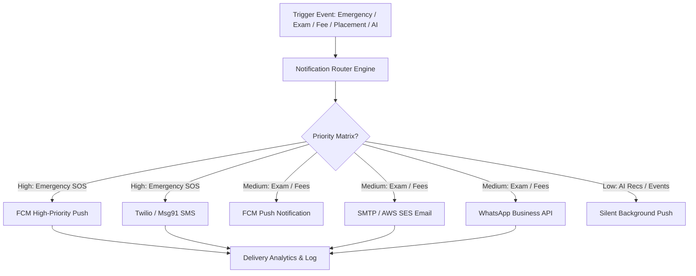

# Enterprise Omnichannel Notification Engine Architecture
## Push (FCM), SMS, Email, WhatsApp Business API & Emergency Broadcast System
**Author**: Lead Notification Architect (Vijay Mahes)  
**Version**: 1.0.0  

---

## 1. System Architecture & Multi-Channel Routing

The **GRI Notification Engine** routes institutional messages across 4 distinct channels based on priority and user preference settings:

---

## 2. Notification Priority Matrix & Fallback Rules

| Category | Channels | Priority Queue | Retry Strategy | SLA Delivery |
|---|---|---|---|---|
| **Emergency SOS** | Push + SMS | `High (Q1)` | 5 retries (10s interval) | `< 5 seconds` |
| **Placement Drives** | Push + Email + WhatsApp | `Medium (Q2)` | 3 retries (1m interval) | `< 1 minute` |
| **Exam & Results** | Push + Email | `Medium (Q2)` | 3 retries (1m interval) | `< 1 minute` |
| **Attendance Alerts** | Push | `Normal (Q3)` | 2 retries (5m interval) | `< 5 minutes` |
| **Fee Due Reminders** | Push + Email + SMS | `Normal (Q3)` | 2 retries (5m interval) | `< 5 minutes` |
| **AI Recommendations** | Push (Silent) | `Low (Q4)` | No retry | Best effort |

---
*End of GRI Notification Engine Architecture Specification.*
