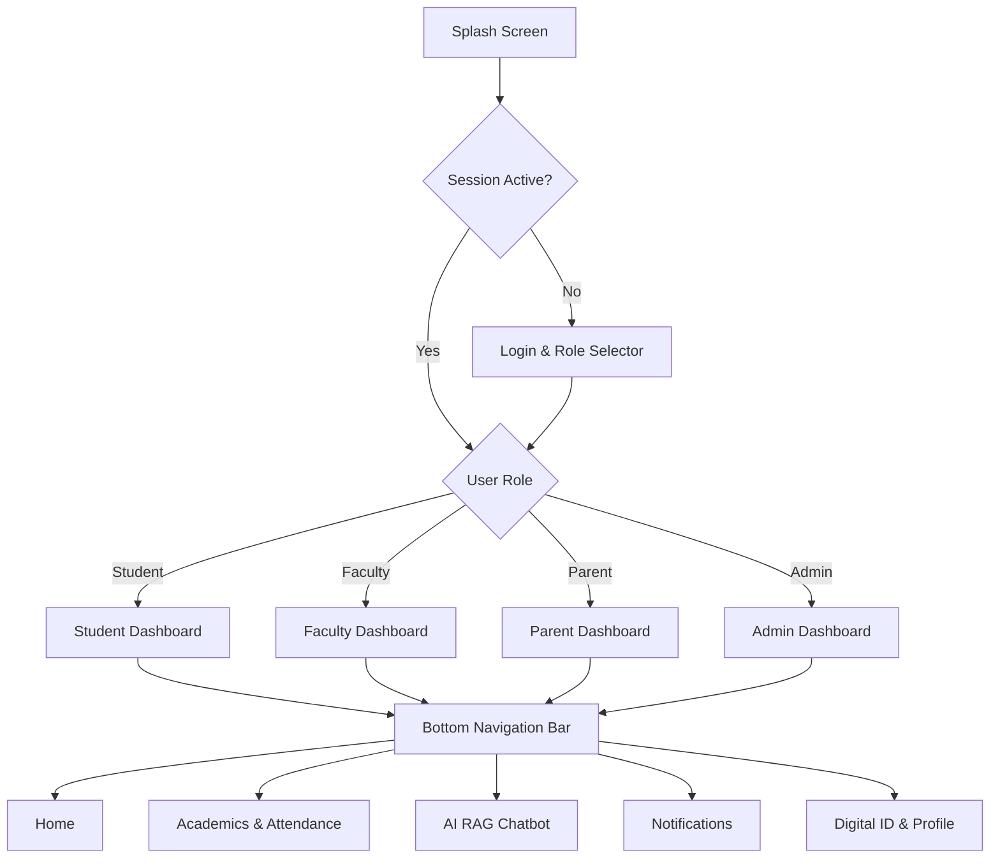

# Enterprise UI/UX Design Specification
## Production-Ready Flutter Application for Gandhigram Rural Institute (GRI)
**Website Reference**: [https://ruraluniv.ac.in](https://ruraluniv.ac.in)  
**Version**: 1.0.0  
**Lead UX Architect**: Vijay Mahes  
**Design System**: Khadi Modernism + Google Material Design 3 (M3)  

---

## 1. Design Philosophy: "Khadi Modernism"

The visual language of the Gandhigram Rural Institute mobile application blends **Mahatma Gandhi's principles of simplicity, self-reliance, and organic texture (Khadi)** with modern **Material Design 3 (M3)** interfaces. 

### Core Pillars:
1. **Clarity & Purpose**: Uncluttered layouts, high-contrast typography, and immediate access to primary actions.
2. **Contextual Role Adaptation**: Tailored visual dashboards for Students, Faculty, Parents, and Administrators.
3. **Inclusive Rural Accessibility**: Optimized for low-end devices, offline usage, and WCAG 2.1 AAA standards.

---

## 2. Design System Tokens

### 2.1 Color Palette (Official Brand Colors)

| Token Name | HEX Code | RGB | Usage |
| :--- | :--- | :--- | :--- |
| **GRI Primary Maroon** | `#911C03` | `rgb(145, 28, 3)` | Main AppBars, Primary Buttons, Active Tabs |
| **Khadi Green** | `#518214` | `rgb(81, 130, 20)` | Accent Cards, Success Indicators, Outreach |
| **Terracotta Amber** | `#F26B0F` | `rgb(242, 107, 15)` | Primary Accents, AI Chat Prompts, Badges |
| **Jubilee Gold** | `#D4AF37` | `rgb(212, 175, 55)` | Honors, CGPA Badges, Convocation Cards |
| **Light Background** | `#F8F9FA` | `rgb(248, 249, 250)` | Light Theme Scaffold Background |
| **Light Surface** | `#FFFFFF` | `rgb(255, 255, 255)` | Elevated Cards, Modals, Drawers |
| **Dark Background** | `#121212` | `rgb(18, 18, 18)` | Dark Theme Scaffold Background |
| **Dark Surface** | `#1E1E1E` | `rgb(30, 30, 30)` | Dark Theme Cards & Dialogs |

---

### 2.2 Typography Scale (Roboto / Plus Jakarta Sans)

| Token | Size | Weight | Line Height | Letter Spacing | Usage |
| :--- | :--- | :--- | :--- | :--- | :--- |
| **Display Large** | `32sp` | Bold (700) | `1.2` | `-0.5px` | Splash Title, Dashboard Headers |
| **Display Medium** | `28sp` | Bold (700) | `1.25` | `-0.25px` | Module Page Titles |
| **Headline Large** | `24sp` | SemiBold (600) | `1.3` | `0px` | Section Titles, Card Headers |
| **Headline Medium** | `20sp` | SemiBold (600) | `1.35` | `0px` | Modal Titles, Subheaders |
| **Title Large** | `18sp` | Medium (500) | `1.4` | `0px` | List Item Titles, Tab Labels |
| **Body Large** | `16sp` | Regular (400) | `1.5` | `0.15px` | Primary Body Text, Chat Bubbles |
| **Body Medium** | `14sp` | Regular (400) | `1.43` | `0.25px` | Secondary Text, Captions |
| **Label Large** | `14sp` | SemiBold (600) | `1.4` | `0.1px` | Buttons, Filter Chips |

---

### 2.3 Spacing & Layout Grid (8pt Grid System)

- **Micro Spacing**: `4dp` (xs), `8dp` (sm)
- **Component Padding**: `16dp` (md), `24dp` (lg)
- **Container Padding**: `32dp` (xl), `48dp` (xxl)
- **Border Radius Standard**: `12dp` (Buttons/Textfields), `16dp` (Cards), `24dp` (Bottom Sheets)

---

## 3. Dark Mode & Accessibility Strategy

### 3.1 OLED-Friendly Dark Mode
- True dark surfaces (`#121212` background, `#1E1E1E` cards) reduce battery consumption on OLED displays by up to **30%**.
- High-contrast text `#E6E1E5` ensures seamless legibility without eye strain.

### 3.2 Accessibility (WCAG 2.1 AAA Compliant)
- **Contrast Ratios**: Minimum **7:1** for body text and **4.5:1** for large headlines.
- **Touch Target Size**: Minimum **48dp x 48dp** for all interactive buttons and icons.
- **Screen Readers**: Full Semantics & Screen Reader accessibility labels (`Semantics(label: "...")`).

---

## 4. User Flow & Navigation Architecture



---

## 5. Screen Wireframes & Component Blueprints

### 5.1 Student Dashboard Wireframe
```
+-------------------------------------------------------+
|  [≡] GRI Mobile Portal            [🔔 3]  [🔍]  [👤] |
+-------------------------------------------------------+
|  Welcome back, Vijay Mahes!                           |
|  B.Tech Computer Science - Semester VI (CGPA: 8.92)   |
+-------------------------------------------------------+
|  [ Quick Actions ]                                    |
|  [📱 Smart ID]   [📊 Attendance]  [📜 Results] [🏠 Outpass]|
+-------------------------------------------------------+
|  Today's Schedule                                     |
|  • 09:30 AM - Data Structures (Room CS-102)           |
|  • 11:15 AM - AI & Machine Learning (Lab 3)           |
+-------------------------------------------------------+
|  [🤖 Ask GRI AI Assistant]                            |
|  "When is the last date for semester fee payment?"   |
+-------------------------------------------------------+
```

---

### 5.2 AI Chatbot (RAG Interface) Wireframe
```
+-------------------------------------------------------+
|  [←] GRI AI Assistant (Powered by RAG)         [⋮]   |
+-------------------------------------------------------+
|                                                       |
|  (🤖 Bot) Hello Vijay! How can I assist you with      |
|  GRI regulations, exams, or campus services today?    |
|                                                       |
|  (👤 You) What are the hostel out-pass rules?        |
|                                                       |
|  (🤖 Bot) According to GRI Hostel Ordinance 2025:     |
|  1. Out-pass applications must be submitted 24h prior. |
|  2. Parent SMS verification is mandatory.              |
|  3. Return cutoff is 06:30 PM.                         |
|  [📄 Source: Hostel_Regulations_2025.pdf]             |
|                                                       |
+-------------------------------------------------------+
|  [💡 Ask fee deadline]  [💡 Exam Timetable]            |
|  [ Input query...                             ]  [➔] |
+-------------------------------------------------------+
```

---

## 6. Micro-Animations & Motion Design

1. **Page Transitions**: Shared Axis (X-axis slide for bottom tabs, Z-axis scale for detail views).
2. **Hero Card Elevation**: Spring curve (`Curves.elasticOut`) elevation change on touch hover.
3. **Button Feedback**: Haptic Feedback (`HapticFeedback.lightImpact()`) on primary button tap.
4. **Loading States**: Shimmer effect for list skeletons (`Shimmer.fromColors()`).

---

## 7. Figma Design Tokens Export Format

```json
{
  "color": {
    "primary": { "value": "#911C03", "type": "color" },
    "secondary": { "value": "#518214", "type": "color" },
    "accent": { "value": "#F26B0F", "type": "color" },
    "gold": { "value": "#D4AF37", "type": "color" }
  },
  "spacing": {
    "xs": { "value": "4px", "type": "dimension" },
    "sm": { "value": "8px", "type": "dimension" },
    "md": { "value": "16px", "type": "dimension" },
    "lg": { "value": "24px", "type": "dimension" },
    "xl": { "value": "32px", "type": "dimension" }
  },
  "border_radius": {
    "sm": { "value": "8px", "type": "dimension" },
    "md": { "value": "12px", "type": "dimension" },
    "lg": { "value": "16px", "type": "dimension" }
  }
}
```

---
*End of UI/UX Specification Document.*
